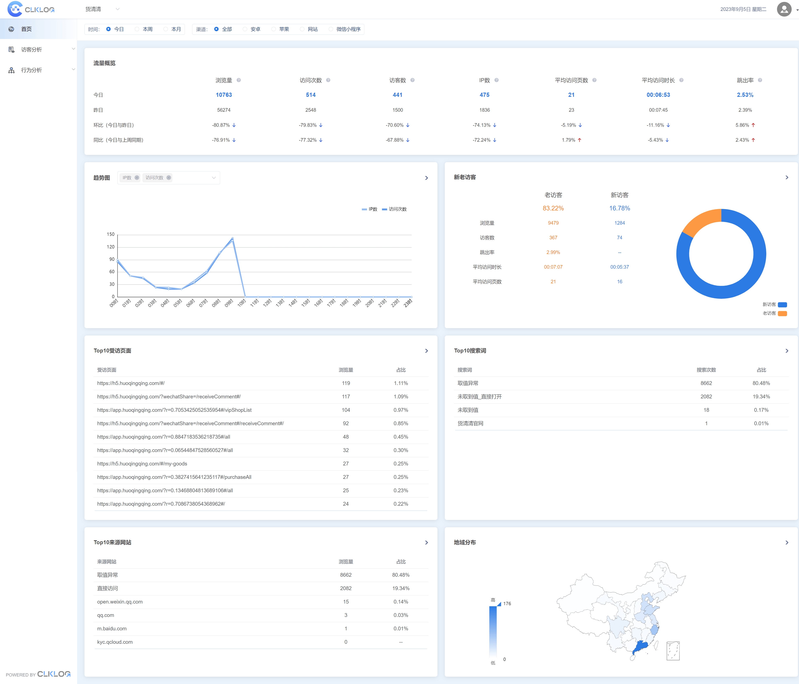
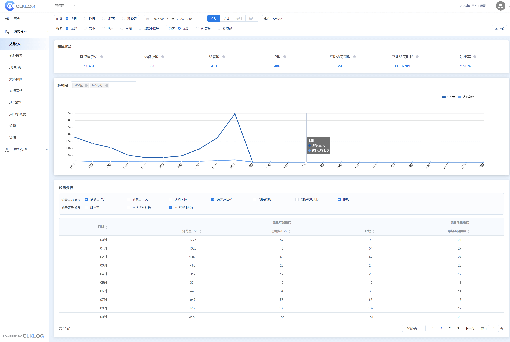
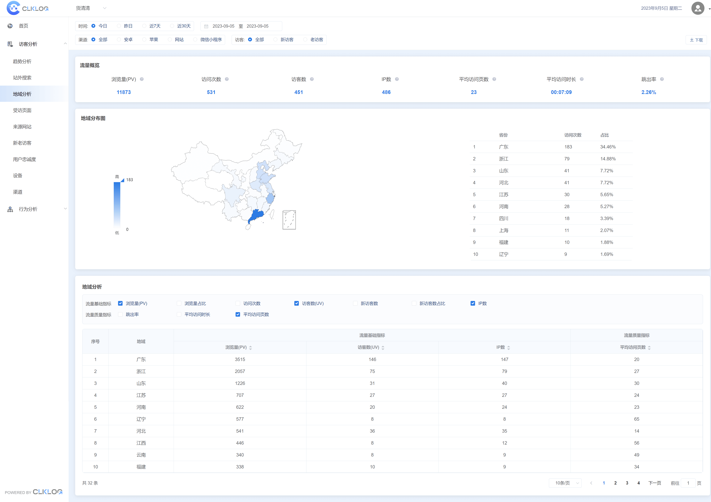
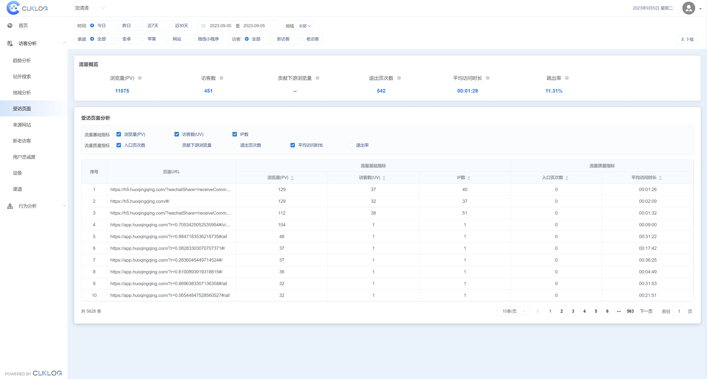
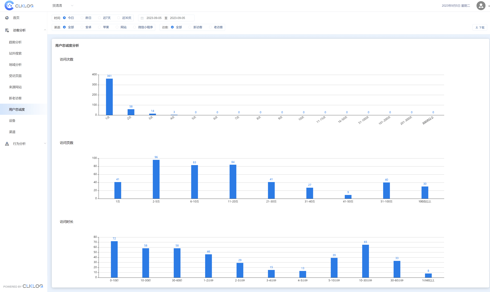
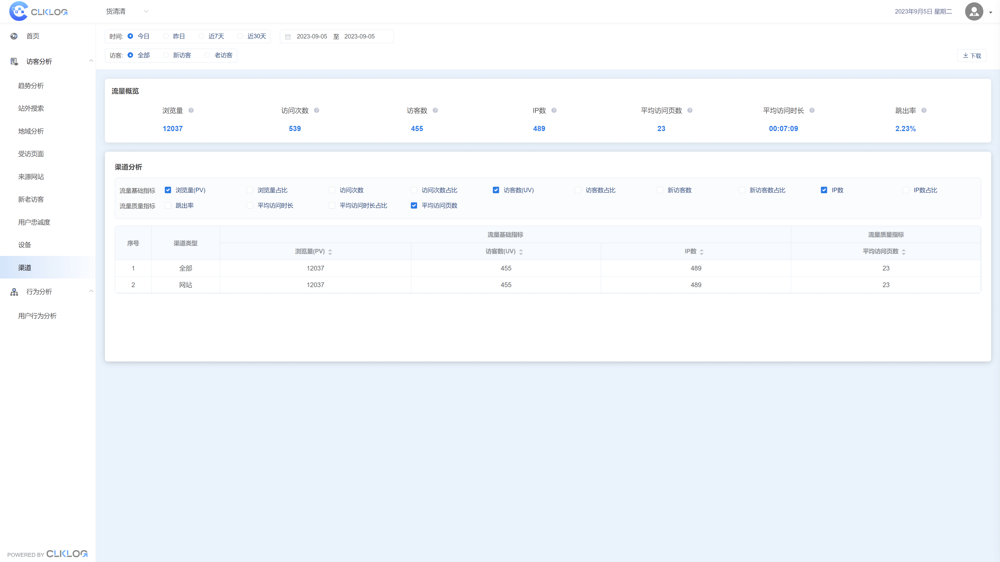
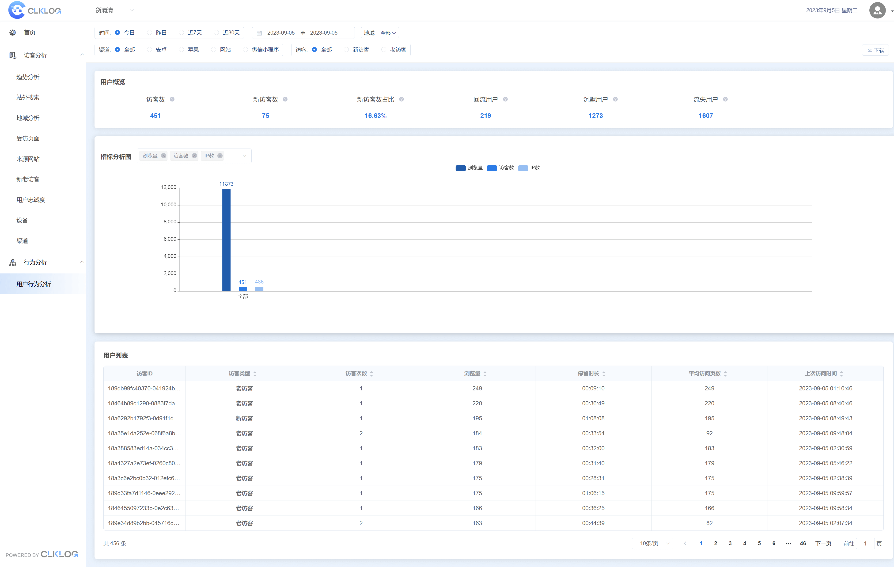
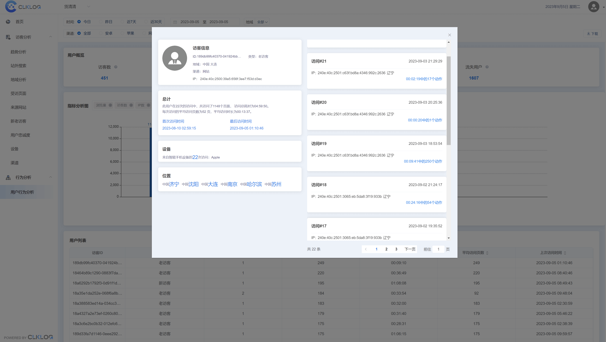

# 项目简介

ClkLog是一款记录并分析用户行为和画像的开源软件，技术人员可快速完成私有化部署。 
ClkLog基于神策分析SDK，采用ClickHouse数据库对采集数据进行存储，使用前后端分离的方式来实现。在这里，你可以轻松看到用户访问网页、APP、小程序或业务系统的行为轨迹，同时也可以从时间、地域、渠道、用户访客类型等多维度了解用户的全方位信息。 
ClkLog在开源社区版本的基础上同时提供拥有更多高级分析功能的商业版本。

# 核心功能

- **数据采集**：支持网页、小程序、IOS、Android等多端数据采集

- **流量概览**：提供流量渠道、设备、地域、访客类型多维度分析

- **用户画像**：解析用户唯一ID，定位追踪用户全生命周期画像

- **数据下载**：支持各项汇总数据、明细数据的下载

# 技术栈选择

- **后端**：Redis 、Zookeeper、Kafka 、Flink

- **前端**：vue、vue-element-admin、element-ui 、echarts

- **数据**：Clickhouse

# 示意图

|  |  |
| --------------------------- | --------------------------- |
|  |  |
|  |  |
|  |  |

# 在线体验

演示地址：<a href="https://demo.clklog.com" target="_blank">https://demo.clklog.com</a>

# 快速接入

官方文档：<a href="https://clklog.com">https://clklog.com</a>

<!-- # 开源社区

问题反馈：[https://github.com/clklog/clklog/issues](https://github.com/clklog/clklog/issues)

参与讨论：[https://github.com/orgs/clklog/discussions](https://github.com/orgs/clklog/discussions) -->

# 协议许可

- 开源协议：[AGPL V3.0](https://www.gnu.org/licenses/agpl-3.0.en.html)

- 免费使用：Clklog遵循AGPL V3.0开源许可证, 使用的组织或个人在复制、分发、转发或修改时请遵守相关条款，不得移除ClkLog相关版权标识进行。如有违反，ClkLog将保留对侵权者追究责任的权利。

- 商业使用：请联系客服进行细节咨询

# 联系我们

- 客服邮箱：<info@clklog.com>

- 客服手机：16621363853

- 客服微信：opensoft66

- 客服二维码：
