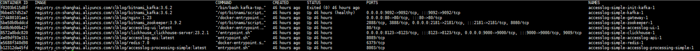

## 环境

- 操作系统：Ubuntu（建议版本 22.04）
- 软件依赖：
  - docker（建议版本24+）
  - docker compose （建议使用最新的版本2.27.0)
- 服务器最低配置要求：
  - 处理器：双核2.5GHz或更高
  - 内存：8GB RAM或更高
  - 存储空间：至少50GB可用硬盘空间
  - 网络：可靠的网络连接，带宽至少为10Mbps

## 准备

1. 下载 AccessLog Docker Compose配置文件，参考代码如下

    ```
   curl -O https://clklog.com/res/docker/accesslog-docker-compose.tar.gz
    ```

2. 拷贝镜像,并解压镜像文件，参考代码如下：

    ```
    tar -zxvf accesslog-docker-compose.tar.gz
    cd accesslog-docker-compose 
    ```
<!-- 
3. 根据实际情况修改`.env`文件中的默认配置：

    ```
    #[Clickhouse]
    # clickhouse用户名
    CK_USER_NAME=default 
    # clickhouse密码
    CK_USER_PWD=clklogpwd 

    #[ClkLog]
    # clklog数据库名称
    CLKLOG_LOG_DB=clklog    
    ``` -->

3. 执行目录初始化脚本，代码如下：

    ```
    mkdir -p accesslog_dc_data/redis
    chown 999 accesslog_dc_data/redis
    mkdir -p   accesslog_dc_data/processing/checkpoints
    chown 9999 accesslog_dc_data/processing/checkpoints
    chgrp 9999 accesslog_dc_data/processing/checkpoints
    mkdir -p   accesslog_dc_data/zookeeper
    chown 1001 accesslog_dc_data/zookeeper
    chgrp 1001 accesslog_dc_data/zookeeper
    mkdir -p   accesslog_dc_data/kafka
    chown 1001 accesslog_dc_data/kafka
    chgrp 1001 accesslog_dc_data/kafka

    ```

## 启动

1. 执行安装命令

   在`accesslog-docker-compose`目录下执行以下命令：

    ```
    docker compose -f docker-compose-accesslog-simple.yml up -d
    ```

2. 查看容器状态

    ```
    docker compose -f docker-compose-accesslog-simple.yml ps -a
    ```

      

3. 验证镜像是否安装成功

   - 前端地址： <http://YOUR_DOMAIN/>  
       - 登录账号/密码：admin/accesslog
  
   - 统计接口说明地址： <http://YOUR_DOMAIN/api/doc.html>

## 日志采集配置

使用vector采集工具采集nginx的access日志，写入kafka,topic为accesslog。

vector配置方法参考：

<https://github.com/clklog/accesslog-scripts/tree/main/vector>

<https://gitee.com/clklog/accesslog-scripts/tree/main/vector>

<https://gitcode.com/clklog/accesslog-scripts/tree/main/vector>
