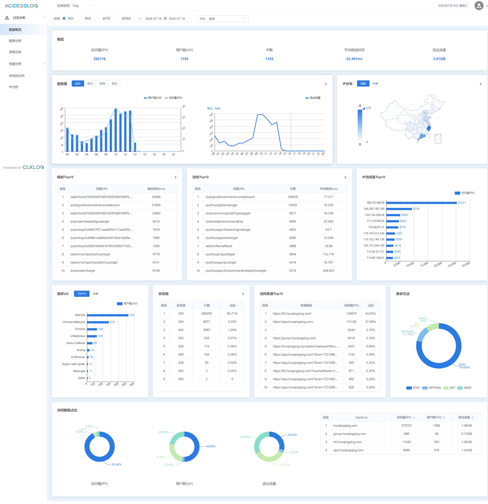
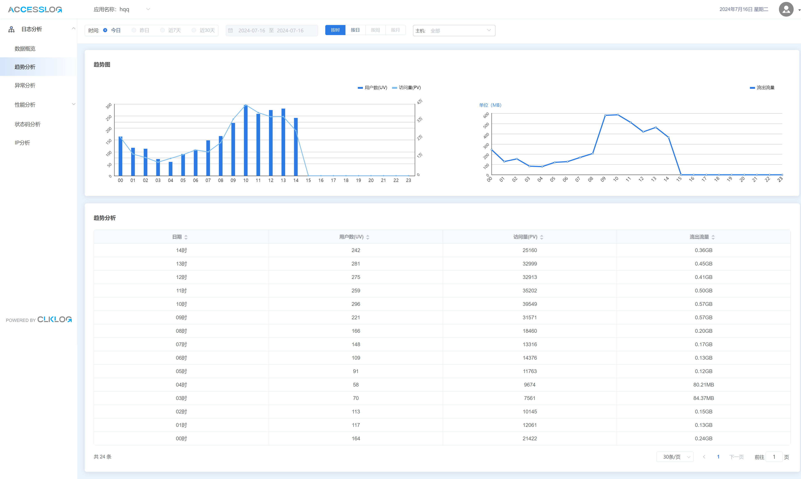
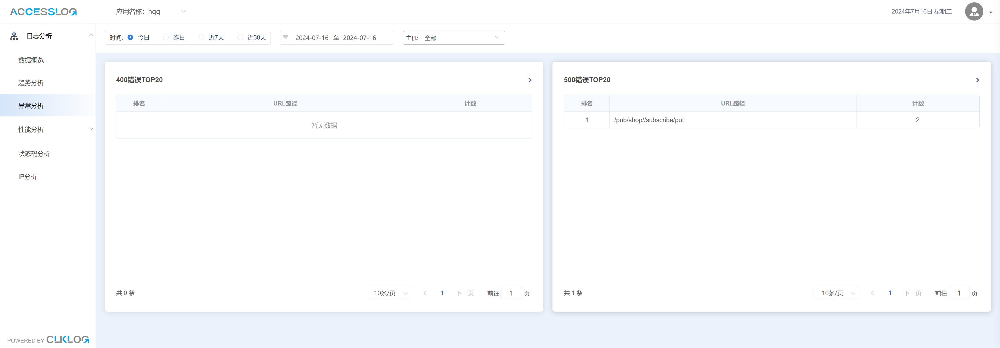
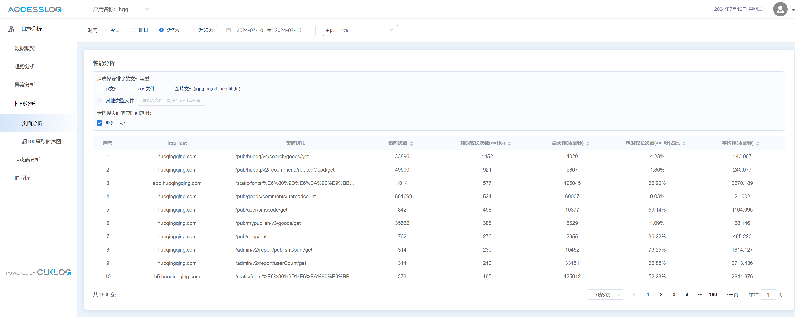
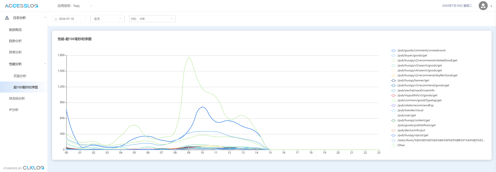
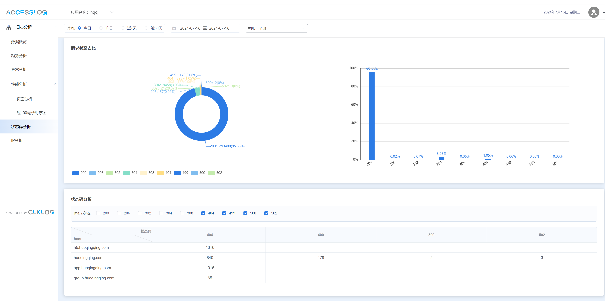
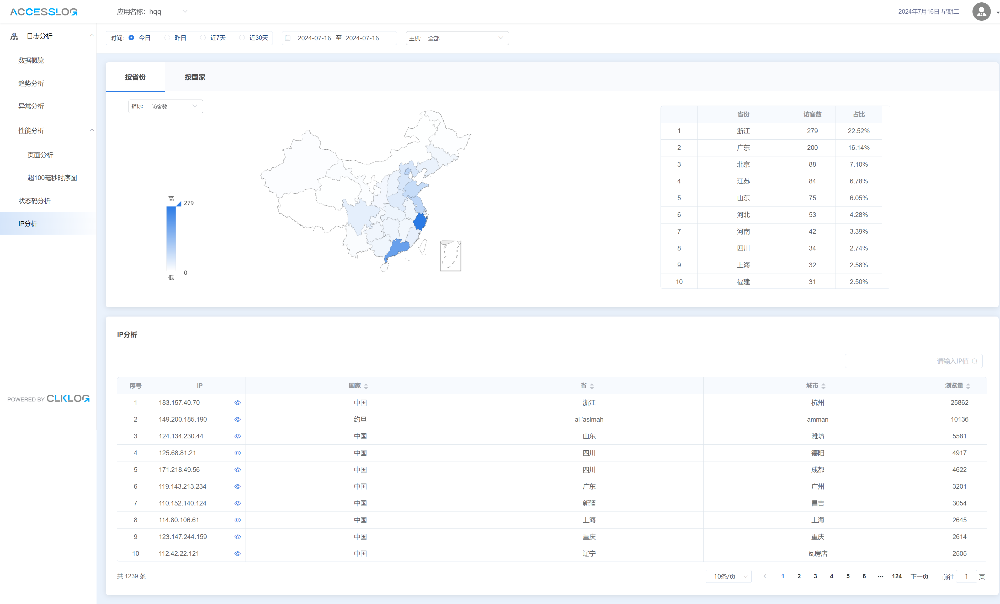
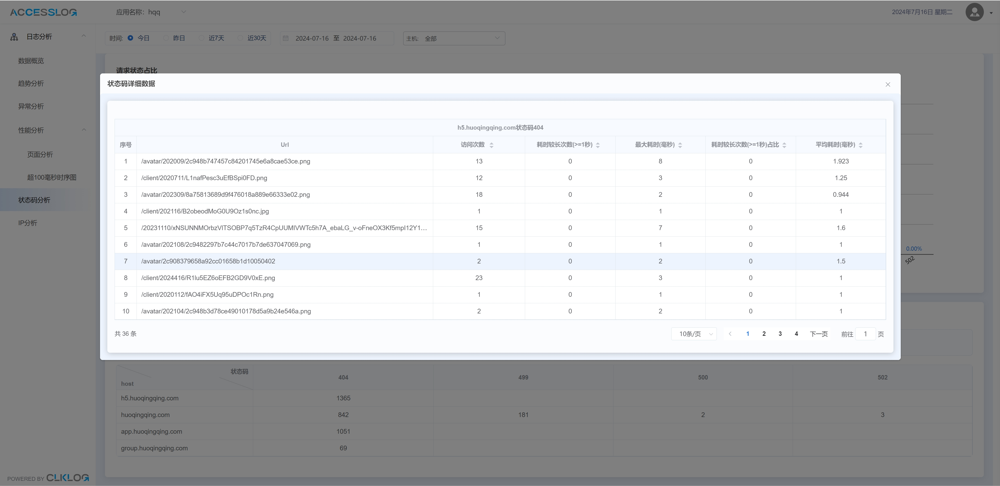

## 什么是AccessLog

AccessLog 是ClkLog下的一款针对服务器日志的采集和数据分析的开源软件，技术人员可快速完成私有化部署。

AccessLog 的核心是系统日志的采集与清洗、系统日志数据的分析与展示。

AccessLog 主要是通过采集工具（推荐：vector或filebeat）对服务器（如nginx、iis）日志进行采集，通过相关服务对采集数据进行处理，然后在可视化的日志查询分析界面对服务器日志进行查询分析。确保在系统运行期间，运维人员能够尽早知道系统出现的问题并介入处理解决问题。

## 核心功能

- **数据采集**: 对服务端的access日志进行采集

- **数据处理**: 对采集日志数据进行处理

- **可视化查询分析**: 通过可视化查询页面对日志进行多维度数据分

## 技术栈选择

- **后端**：Redis 、Kafka 、Flink

- **前端**：vue、vue-element-admin、element-ui 、echarts

- **数据**：Clickhouse

## 示意图

|  |  |
| ----------------------------------- | ----------------------------------- |
|  |  |
|  |  |
|  |  |
