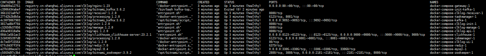
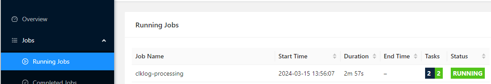

## 准备

1. 下载 ClkLog Docker Compose配置文件，参考代码如下

   - github 镜像下载

    ```
    curl -O https://github.com/clklog/clklog-deploy/raw/refs/heads/main/releases/clklog-docker-compose-1.2.0.tar.gz
    ```

   - gitee 镜像下载

    ```
    curl -O https://gitee.com/clklog/clklog-deploy/raw/main/releases/clklog-docker-compose-1.2.0.tar.gz
    ```

   <!-- - gitcode 镜像下载

    ```
    curl -O 
    https://gitcode.com/clklog/clklog-deploy/blob/main/releases/clklog-docker-compose-1.1.0.tar.gz
    
    ``` -->

2. 拷贝镜像,并解压镜像文件，参考代码如下：

    ```
    tar -zxvf clklog-docker-compose-1.2.0.tar.gz
    cd clklog-docker-compose 
    ```
<!-- 
1. 根据实际情况修改`.env`文件中的默认配置：

    ```
    #[Clickhouse]
    # clickhouse用户名
    CK_USER_NAME=default 
    # clickhouse密码
    CK_USER_PWD=clklogpwd 

    #[ClkLog]
    # clklog数据库名称
    CLKLOG_LOG_DB=clklog    
    ``` -->

2. 执行目录初始化脚本，代码如下：

    ```
    mkdir -p clklog_dc_data/redis
    chown 999 clklog_dc_data/redis
    mkdir -p   clklog_dc_data/processing/checkpoints
    chown 9999 clklog_dc_data/processing/checkpoints
    chgrp 9999 clklog_dc_data/processing/checkpoints
    mkdir -p   clklog_dc_data/zookeeper
    chown 1001 clklog_dc_data/zookeeper
    chgrp 1001 clklog_dc_data/zookeeper
    mkdir -p   clklog_dc_data/kafka
    chown 1001 clklog_dc_data/kafka
    chgrp 1001 clklog_dc_data/kafka

    ```

## 启动

1. 执行安装命令

   在`clklog-docker-compose`目录下执行以下命令：

    ```
    docker compose -f docker-compose-clklog-full.yml up -d
    ```

2. 查看容器状态

    ```
    docker compose -f docker-compose-clklog-full.yml ps -a
    ```

      

3. 验证镜像是否安装成功

   - 前端地址： <http://YOUR_DOMAIN/>

   - 统计接口说明地址： <http://YOUR_DOMAIN/api/doc.html>

   - 埋点数据接收地址： <http://YOUR_DOMAIN/receiver/api/gp?project=clklogapp&token=5388ed7459ba4c4cad0c8693fb85630a>

   - flink后台地址： <http://YOUR_DOMAIN/flink/#/overview>，在flink后台查看job状态是否正常运行

     

## [切换快速模式](/docker_installation/modetoggle.md#标准模式切换快速模式)

## 埋点代码接入

   埋点代码接入方式参考：[sdk-埋点集成参考](/integration/reference.md)
