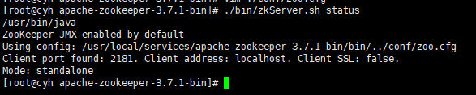
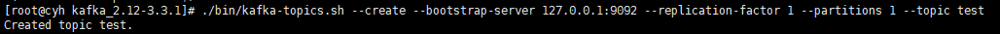
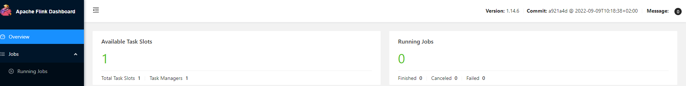

## 环境准备
<!-- - Ubuntu SMP -->
- Linux服务器（本文档以ubuntu为例）
- JDK 1.8
- Nginx 1.18
- Redis 3.2.4
- Zookeeper 3.7.2
- Kafka 2.12-3.3.1
- Flink 1.14.6
- Clickhouse 23.2.1
- nodejs >= 8.9
- npm >=3.0.0
<!-- - mysql -->

## 初始化步骤参考

创建安装目录

```
mkdir /usr/local/services
```

### Java 1.8 安装参考

1. 安装Java
    通过apt-get安装jdk8

    ```
    sudo apt-get install openjdk-8-jdk
    ```

    或下载 jdk-8u211-linux-x64.rpm

    ```
    rpm -ivh jdk-8u211-linux-x64.rpm
    ```

2. 验证java版本

    ```
    java -version
    ```

### nginx 安装参考

```

sudo apt-get install nginx
systemctl start nginx

```

- #### [nginx安装注意事项](quickstart/question.md#nginx安装注意事项)

### Redis 3.2.4 安装参考

1. 从 Redis 官网下载安装包

    ```
    wget https://download.redis.io/releases/redis-3.2.4.tar.gz
    ```

2. 解压

    将安装包拷贝至`/usr/local/services/`目录并解压, 解压后进入`redis`安装目录：

    ```
    cd /usr/local/services/
    tar xzf redis-3.2.4.tar.gz
    cd redis-3.2.4
    ```

3. 安装make与gcc

    ```
    sudo apt-get install make gcc
    ```

4. 编译依赖后make

    ```
    cd ./deps
    sudo make hiredis jemalloc linenoise lua geohash-int
    cd ../
    sudo make
    ```

5. 安装Redis

    ```
    make install
    ```

    默认情况下，Redis 会被安装在`/usr/local/bin`目录下

- #### [redis安装注意事项](quickstart/question.md#redis安装注意事项)

5. 修改配置

    拷贝`redis.conf` 至`/etc/redis/redis.conf`

    ```
    mkdir /etc/redis
    cp redis.conf /etc/redis/redis.conf
    ```

    修改配置文件：`/etc/redis/redis.conf`

    ```
    vim /etc/redis/redis.conf

    protected-mode no
    daemonize yes
    appendonly yes
    ```  

6. 启动服务

    ```
    /usr/local/bin/redis-server /etc/redis/redis.conf
    ```

7. 检查安装是否成功

    ```
    cd /usr/local/bin
    ./redis-cli
    ```

<br>

### Zookeeper 3.7.2 安装参考

1. 从  Zookeeper  官网下载安装包

    ```
    wget --no-check-certificate https://dlcdn.apache.org/zookeeper/zookeeper-3.7.2/apache-zookeeper-3.7.2-bin.tar.gz
    ```

2. 解压

    将安装包拷贝至`/usr/local/services/`目录并解压, 解压后进入`Zookeeper`安装目录：

    ```
    cd /usr/local/services/
    tar -zxvf apache-zookeeper-3.7.2-bin.tar.gz
    cd apache-zookeeper-3.7.2-bin
    ```

3. 修改配置

    根据配置模板拷贝配置文件，增加配置项

    ```
    cp ./conf/zoo_sample.cfg ./conf/zoo.cfg

    admin.serverPort=8887
    ```

4. 启动zk

    ```
    ./bin/zkServer.sh start
    ```

5. 检查

    ```
    ./bin/zkServer.sh status
    ```

    

    未启动成功，从`./logs`里查看启动日志

<br>

### Kafka 2.12-3.3.1 安装参考

1. 从 Kafka 官网下载安装包

    ```
    wget --no-check-certificate https://archive.apache.org/dist/kafka/3.3.1/kafka_2.12-3.3.1.tgz
    ```

2. 解压

    将安装包拷贝至`/usr/local/services/`目录并解压, 解压后进入`Kafka`安装目录：

    ```
    cd /usr/local/services/
    tar -xzf kafka_2.12-3.3.1.tgz
    cd kafka_2.12-3.3.1
    ```

3. 启动

    ```
    ./bin/kafka-server-start.sh  -daemon config/server.properties
    ```

4. 检查

    创建名为`test`的`topic`

    ```
    ./bin/kafka-topics.sh --create --bootstrap-server 127.0.0.1:9092 --replication-factor 1 --partitions 1 --topic test
     ```

    

    查看`topic`

    ```

    ./bin/kafka-topics.sh --bootstrap-server 127.0.0.1:9092 --describe --topic test

    ```

    

    不报错正常，如果未启动成功，从`./logs`里查看启动日志

### Flink 1.14.6 安装参考

1. 从 Flink官网下载安装包

    ```
    wget https://archive.apache.org/dist/flink/flink-1.14.6/flink-1.14.6-bin-scala_2.12.tgz
    ```

2. 解压

    将安装包拷贝至`/usr/local/services/`目录，重命名为`flink-1.14.6.tgz`后解压, 解压后进入`Flink`安装目录：

    ```
    cd /usr/local/services/
    mv flink-1.14.6-bin-scala_2.12.tgz flink-1.14.6.tgz
    tar -xzf flink-1.14.6.tgz
    cd flink-1.14.6
    ```

3. 启动

    建议不要使用root启动 , 启动代码参考如下:

    ```
    ./bin/start-cluster.sh
    ```

4. 检查

    <http://localhost:8081/>

    

### Clickhouse 23.2.1 安装参考

1. 安装clickhouse
   安装参考：<https://clickhouse.com/docs/en/install>

2. 修改用户验证信息

    修改`/etc/clickhouse-server/users.xml`文件，在<users>标签下设置用户验证信息。比如，我们设定一个用户名为`default`，密码为`123456`。

    更多设置请参考ClickHouse官方文档。

3. 启动数据库

    ```
    sudo systemctl enable clickhouse-server  
    sudo systemctl start clickhouse-server  
    sudo systemctl status clickhouse-server  
    ```

4. 登录数据库

    ```
    clickhouse-client -u default --password 123456
    ```
<!-- 
### MySql 安装参考

1. 安装mysql

```

apt install mysql-server

```

2. 修改密码

```

ALTER USER 'root'@'localhost' IDENTIFIED WITH mysql_native_password BY 'your_password'; -->
```
