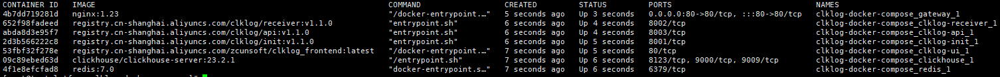
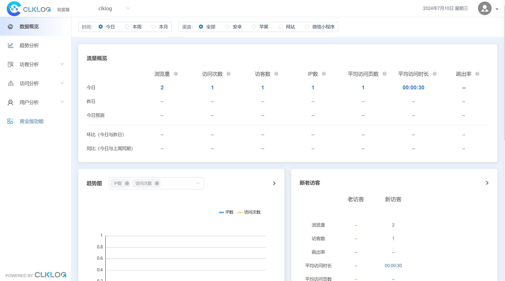

## 环境

 准备一台linux服务器，建议操作系统版本为：ubuntu, 安装docker、docker-compose。

## 准备

1. 下载 ClkLog Docker Compose配置文件，参考代码如下

    ```
   curl -O https://clklog.com/res/docker/clklog-docker-compose.tar.gz
    ```

2. 拷贝镜像,并解压镜像文件，参考代码如下：

    ```
    tar -zxvf clklog-docker-compose.tar.gz
    cd clklog-docker-compose 
    ```
<!-- 
3. 根据实际情况修改`.env`文件中的默认配置：

    ```
    #[Clickhouse]
    # clickhouse用户名
    CK_USER_NAME=default 
    # clickhouse密码
    CK_USER_PWD=clklogpwd 

    #[ClkLog]
    # clklog数据库名称
    CLKLOG_LOG_DB=clklog    
    ``` -->

3. 执行目录初始化脚本，代码如下：

    ```
    mkdir -p clklog_dc_data/redis
    chown 999 clklog_dc_data/redis
    mkdir -p   clklog_dc_data/processing/checkpoints
    chown 9999 clklog_dc_data/processing/checkpoints
    chgrp 9999 clklog_dc_data/processing/checkpoints
    mkdir -p   clklog_dc_data/zookeeper
    chown 1001 clklog_dc_data/zookeeper
    chgrp 1001 clklog_dc_data/zookeeper
    mkdir -p   clklog_dc_data/kafka
    chown 1001 clklog_dc_data/kafka
    chgrp 1001 clklog_dc_data/kafka

    ```

## 启动

1. 执行安装命令

   在`clklog-docker-compose`目录下执行以下命令：

    ```
    docker compose -f docker-compose-clklog-simple.yml up -d
    ```

2. 查看容器状态

    ```
    docker compose -f docker-compose-clklog-simple.yml ps -a
    ```

      

3. 验证镜像是否安装成功

   - 前端地址： <http://YOUR_IP/>  
       - 登录账号/密码：admin/clklog
  
   - 统计接口说明地址： <http://YOUR_IP/api/doc.html>

   - 埋点数据接收地址： <http://YOUR_IP/receiver/api/gp?project=clklogapp&token=5388ed7459ba4c4cad0c8693fb85630a>

## 埋点代码接入

   埋点代码接入方式参考：[sdk-埋点集成](/quickstart/deployment.md#_11-sdk-埋点集成)

## 验证埋点接入是否成功

- 埋点代码接入成功后，等待1分钟，返回前端 <http://YOUR_IP/> ，刷新数据概览页面，如下图所示，当页面上的浏览概览相关数据值开始有数据说明埋点接入成功。
     
