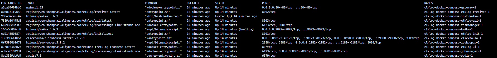

## 准备

[参考快速模式安装准备](/installation/quickmode.md#准备)

## 启动

1. 执行安装命令

   在`clklog-docker-compose`目录下执行以下命令：

    ```
    docker compose -f docker-compose-clklog-full.yml up -d
    ```

2. 查看容器状态

    ```
    docker compose -f docker-compose-clklog-full.yml ps -a
    ```

      

3. 验证镜像是否安装成功

   - 前端地址： <http://YOUR_IP/>

   - 统计接口说明地址： <http://YOUR_IP/api/doc.html>

   - 埋点数据接收地址： <http://YOUR_IP/receiver/api/gp?project=clklogapp&token=5388ed7459ba4c4cad0c8693fb85630a>

   - flink后台地址： <http://YOUR_IP/flink/#/overview>，在flink后台查看job状态是否正常运行

     

<!-- 4. 下载[clklog-processing](https://gitee.com/clklog/clklog-processing/releases) -->

<!-- 5. 提交 job

   在flink后台提交`clklog-processing`的jar包：

     

   在flink后台查看job状态

      -->

## 模式切换

### 快速模式切换标准模式

- 1. 停止并删除容器:`docker compose -f docker-compose-clklog-simple.yml down`。
- 2. 启动服务：`docker compose -f docker-compose-clklog-full.yml up -d`。
- 3. 后续步骤参考标准模式安装步骤。

### 标准模式切换快速模式

#### 方式1

- 1. 将`docker-compose-clklog-full.yml`中设置`RECEIVER_ENABLE_SIMPLE_VERSION`为`true`。
- 2. 注释`docker-compose-clklog-full.yml`文件中`kafka`,`zookeeper`,`flink(jobmanager,taskmanager)`的相关配置,并停止对应容器。
- 3. 停止并删除`clklog-receiver`容器，再执行命令：`docker compose -f docker-compose-clklog-full.yml up -d`。

#### 方式2

- 1. 停止并删除容器:`docker compose -f docker-compose-clklog-full.yml down`。
- 2. 启动服务： `docker compose -f docker-compose-clklog-simple.yml up -d`。
