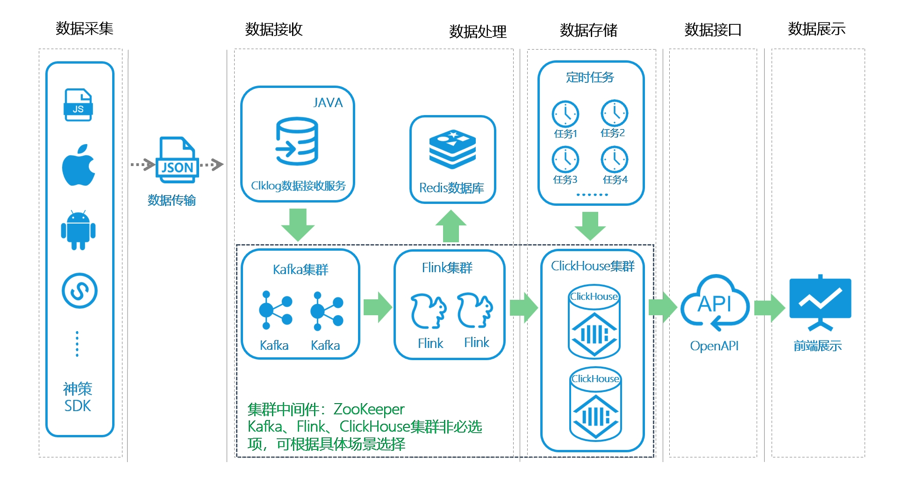
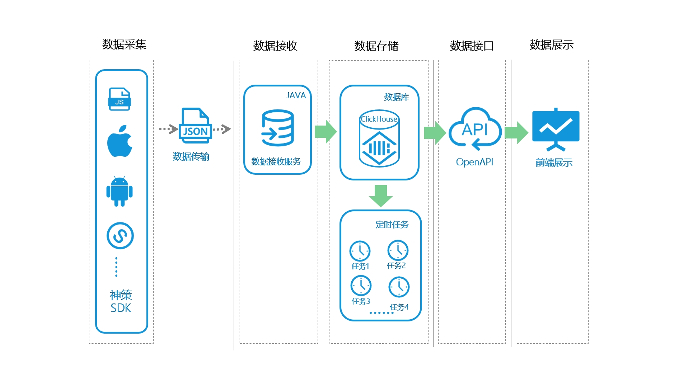

<!-- # 产品介绍 -->

## 什么是ClkLog

ClkLog是一款记录并分析用户行为和画像的开源软件，技术人员可快速完成私有化部署。 
ClkLog基于神策分析SDK，采用ClickHouse数据库对采集数据进行存储，使用前后端分离的方式来实现。在这里，你可以轻松看到用户访问网页、APP、小程序或业务系统的行为轨迹，同时也可以从时间、地域、渠道、用户访客类型等多维度了解用户的全方位信息。 
ClkLog在开源社区版本的基础上同时提供拥有更多高级分析功能的付费版本。

## 核心功能

- **数据采集**：支持网页、小程序、IOS、Android等多端数据采集

- **数据治理**：制定清洗规制、实现数据自动化清洗和治理

- **流量概览**：提供流量渠道、设备、地域、访客类型等多维度分析

- **用户画像**：解析用户唯一ID，定位追踪用户全生命周期画像

- **数据下载**：支持各项汇总数据、明细数据的下载

## 技术栈选择

- **后端**：Java、Redis 、Zookeeper、Kafka 、Flink

- **前端**：vue、vue-element-admin、element-ui 、echarts

- **数据**：Clickhouse、mysql

## 系统架构

<!-- tabs:start -->

#### **标准模式**

**采集日志直接存入clickhouse**
>

#### **快速模式**

**采集日志数据先存入kafka，经由flink处理后再存入clickhouse**

<!-- tabs:end -->

#### **模式区别**

<table>
   <tr>
        <th></th>
        <th>标准模式</th>
        <th>快速模式</th>
    </tr>
    <tr>
        <th rowspan=5> 模式区别
        </th>
        <td align=center>
        采集的埋点数据通过中间件进行队列缓冲和流式计算然后写入数据库
        </td>
        <td  align=center>
        采集的埋点数据直接写入数据库，不需要中间件系统缓存和处理
        </td>
    </tr>
    <tr>
        <td  align=center>满足高可用性能要求</td>
        <td  align=center>满足一般性能要求</td>
    </tr>
    <tr>
        <td  align=center>采集数据不会丢失</td>
        <td  align=center>采集数据可能会丢失</td>
    </tr>
    <tr>
        <td  align=center>部署流程相对复杂</td>
        <td  align=center>部署流程简单</td>
    </tr>
    <tr>
        <td  align=center>二开门槛相对较高</td>
        <td  align=center>二开门槛较低</td>
    </tr>
    <tr>
        <th>适用场景</th>
        <td  align=center>
        网站访问量极大、业务场景复杂、
        数据安全性可靠性较高、性能要求较高
        </td>
        <td  align=center>
        网站访问量较小、业务场景比较简单
        </td>
    </tr>
</table>

>[!tip]可根据实际情况选择标准模式还是快速模式部署，后续也可进行模式切换.
>
> [Docker部署模式切换参考](</docker_installation/modetoggle>)
>
> [源码部署模式切换参考receiver配置的enable-simple-version配置](/installation/deployment.md#_6部署接收服务-clklog-receiver)

## 项目组成

- **接收服务 【clklog-receiver】**：接收客户端采集的日志数据并存入kafka。

- **处理服务  【clklog-processing】**： 依托flink，消费kafka数据并存入clickhouse。

- **处理脚本 【clklog-scripts】**：基于Clickhouse集群中的log_analysis表进行多维计算，获得各个维度上的统计报表。使用Cron来进行任务的定时调度。

- **统计接口 【clklog-api】**： 提供多维度数据统计接口。

- **统计展示 【clklog-ui】**：基于 vue-element-admin 实现的统计分析数据界面展示。

## 示意图

|  |  |
| ------------------------- | ------------------------- |
|  |  |
|  |  |
|  |  |
