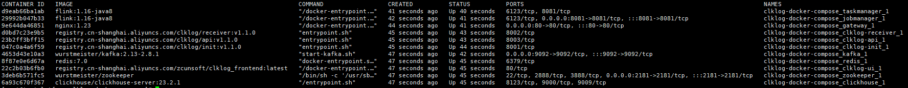

  
## 镜像准备

1. ClkLog Docker Compose配置下载：

    <a href="https://clklog.com/res/docker/clklog-docker-compose.tar.gz?r=240402" target="_blank" rel="noopener" id="docker-compose-tar">下载clklog-docker-compose.tar.gz</a>

2. 拷贝镜像至linux服务器（假设服务器ip为10.10.222.21）,并解压镜像文件，参考代码如下：

    ```
    tar -zxvf clklog-docker-compose.tar.gz
    cd clklog-docker-compose 
    ```

3. 修改`.env`文件，根据实际情况修改相应配置：

    ```
    #[Clickhouse]
    # clickhouse用户名
    CK_USER_NAME=default 
    # clickhouse密码
    CK_USER_PWD=clklogpwd 

    #[ClkLog]
    # clkog数据库名称
    CLKLOG_LOG_DB=clklog    
    # 默认前端埋点project默认名称，一般不用修改
    PROJECT_NAME=clklogapp 
    # 埋点网站域名配置，多个域名以英文逗号分隔
    PROJECT_HOST=http(s)://{{hostname}} 
    ```

4. 执行`clklog_init`脚本，代码如下：

    ```
    chmod 500 clklog_init.sh
    bash clklog_init.sh
    ```

## 镜像介绍

   Clklog Docker Compose包含标准模式和快速模式两种。

   标准模式：采集日志数据先存入kafka，经由flink处理后再存入clickhouse。

   快速模式：表示日志直接存入clickhouse。

   安装过程中可以根据实际需求选择采用标准模式还是快速模式，后续过程可以切换模式。

   [标准模式和快速模式架构参考](/introduce.md?id=系统架构)

## 镜像安装

### 快速模式

1. 快速模式安装命令

   在`clklog-docker-compose`目录下执行以下命令：

    ```
    docker compose -f docker-compose-clklog-simple.yml up -d
    ```

2. 查看容器状态

    ```
    docker compose -f docker-compose-clklog-simple.yml ps -a
    ```

      

3. 验证镜像是否安装成功

   - 前端地址： <http://10.10.222.21/>

   - 统计接口说明地址： <http://10.10.222.21/api/doc.html>

   - 埋点数据接收地址： <http://10.10.222.21/receiver/api/gp?project=clklogapp&token=5388ed7459ba4c4cad0c8693fb85630a>

### 标准模式

1. 标准模式安装命令

   在`clklog-docker-compose`目录下执行以下命令：

    ```
    docker compose -f docker-compose-clklog-full.yml up -d
    ```

2. 查看容器状态

    ```
    docker compose -f docker-compose-clklog-full.yml ps -a
    ```

      

3. 验证镜像是否安装成功

   - 前端地址： <http://10.10.222.21/>

   - 统计接口说明地址： <http://10.10.222.21/api/doc.html>

   - 埋点数据接收地址： <http://10.10.222.21/receiver/api/gp?project=clklogapp&token=5388ed7459ba4c4cad0c8693fb85630a>

   - flink后台地址： <http://10.10.222.21/flink/#/overview>

4. 下载[clklog-processing](https://gitee.com/clklog/clklog-processing/releases)

5. 提交 job

   在flink后台提交`clklog-processing`的jar包：

     

   在flink后台查看job状态

     

## 埋点代码接入

   埋点代码接入方式参考：[sdk-埋点集成](/quickstart/deployment.md#_9-sdk-埋点集成)

## 模式切换

### 快速模式切换标准模式

- 1. 停止并删除容器:`docker compose -f docker-compose-clklog-simple.yml down`。
- 2. 启动服务：`docker compose -f docker-compose-clklog-full.yml up -d`。
- 3. 后续步骤参考标准模式安装步骤。

### 标准模式切换快速模式

#### 方式1

- 1. 将`docker-compose-clklog-full.yml`中设置`RECEIVER_ENABLE_SIMPLE_VERSION`为`true`。
- 2. 注释`docker-compose-clklog-full.yml`文件中`kafka`,`zookeeper`,`flink(jobmanager,taskmanager)`的相关配置,并停止对应容器。
- 3. 停止并删除`clklog-receiver`容器，再执行命令：`docker compose -f docker-compose-clklog-full.yml up -d`。

#### 方式2

- 1. 停止并删除容器:`docker compose -f docker-compose-clklog-full.yml down`。
- 2. 启动服务： `docker compose -f docker-compose-clklog-simple.yml up -d`。
