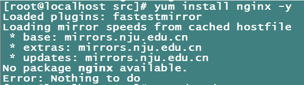
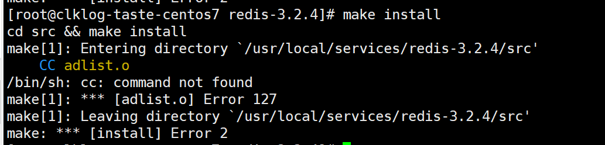

# 常见问题

- ## nginx安装注意事项

    如下图所示，yum install nginx 安装nginx可能会出现没有本地yum源中没有nginx的情况

    

    出现这个的原因是因为本地yum源中没有我们想要的nginx，那么我们就需要创建一个/etc/yum.repos.d/nginx.repo的文件，新增一个yum源。

1. 创建nginx.repo的文件

    ```
    vi /etc/yum.repos.d/nginx.repo
    ```

2. 在文件中写入以下内容

    ```
    [nginx]
    name=nginx repo
    baseurl=http://nginx.org/packages/centos/$releasever/$basearch/
    gpgcheck=0
    enabled=1
    ```

3. 退出保存后，重新执行安装

    [查看nginx安装步骤](preparation.md#nginx安装注意事项)

- ## redis安装注意事项

    如下图所示，make install 安装redis可能会出现系统无gcc环境的情况

    

    解决方案如下：

1. 安装gcc

    ```
    yum install gcc-c++
    ```

2. 清空上次编译失败残留文件

    ```
    yum make distclean
    ```

3. 执行编译及安装

    ```
    yum make install
    ```

    [查看Redis安装步骤](preparation.md#redis安装注意事项)

- ## nginx 出现权限问题（13：Permission denied）

    解决方案如下：

1. 将SELINUX=enforcing 修改为 SELINUX=disabled 状态

    ```
    vi /etc/selinux/config
    
    #SELINUX=enforcing
    SELINUX=disabled
    ```

2. 重启生效

    ```
    reboot
    ```
